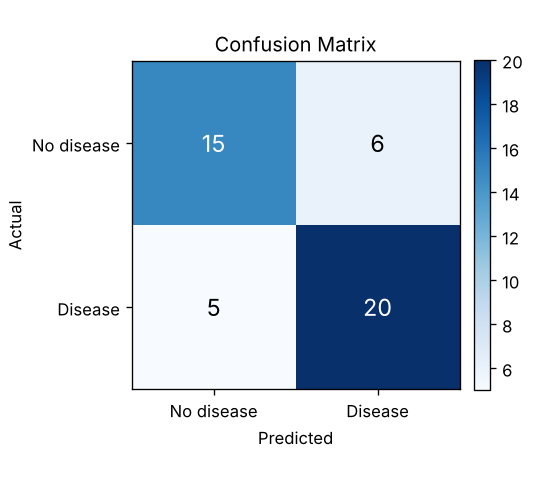
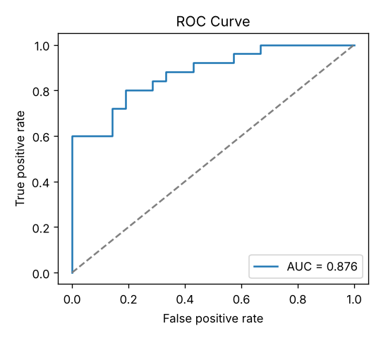
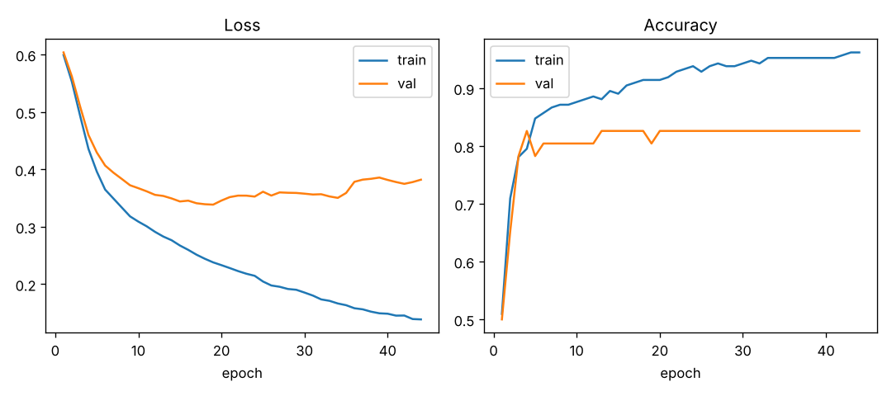

# Heart Disease Prediction — Deep Learning

A deep-learning (neural network) model that predicts whether a patient has heart
disease from 13 routine clinical measurements. Built as a **Project-Based
Learning (PBL)** assignment for a Deep Learning course.

The model is a compact fully-connected neural network (MLP) trained on the
classic **UCI Cleveland Heart Disease** dataset, with a clean, reproducible
pipeline: data → EDA → preprocessing → training → evaluation → inference.

---

## Results

Trained with the default settings (seed = 42) and evaluated on a held-out test
set of 46 patients:

| Metric | Score |
|-----------|:-----:|
| Accuracy | 0.761 |
| Precision | 0.769 |
| Recall (sensitivity) | 0.800 |
| F1-score | 0.784 |
| **ROC-AUC** | **0.876** |

> For a medical screening task, **recall** (catching patients who actually have
> the disease) matters most — the model recovers 80% of true cases, and the
> ROC-AUC of 0.876 shows strong overall separability. The test set is small, so
> individual metrics will shift somewhat with a different random seed; the
> numbers above are fully reproducible with the committed configuration.

| Confusion matrix | ROC curve | Training curves |
|---|---|---|
|  |  |  |

---

## Dataset

The **Cleveland Heart Disease** dataset (303 records, 13 features, binary
target). See [`data/README.md`](data/README.md) for the full column dictionary
and source/licence details.

- Target: `1` = heart disease present, `0` = absent (165 / 138 split).
- One exact-duplicate row is dropped during preprocessing.

---

## Project structure

```
heart-disease-prediction/
├── data/
│   ├── heart.csv              # the dataset
│   └── README.md             # column dictionary + source
├── src/
│   ├── data.py               # load + preprocess (ColumnTransformer, stratified split)
│   ├── model.py              # HeartMLP — the neural network
│   ├── train.py              # training loop + early stopping, saves artifacts
│   ├── evaluate.py           # metrics + plots
│   └── predict.py            # single-patient inference demo
├── notebooks/
│   └── heart_disease_prediction.ipynb   # end-to-end walkthrough for the report
├── results/                  # trained model, metrics, plots (regenerable)
├── requirements.txt
├── LICENSE
└── README.md
```

---

## Model

A multi-layer perceptron suited to small tabular data:

```
Input (27 features after encoding)
  → Linear(64) → BatchNorm → ReLU → Dropout(0.3)
  → Linear(32) → BatchNorm → ReLU → Dropout(0.3)
  → Linear(1)  → (sigmoid at inference)
```

Trained with **Adam**, **BCEWithLogitsLoss** (with mild class weighting), and
**early stopping** on the validation loss.

### Preprocessing

All handled by one scikit-learn `ColumnTransformer` so the exact transform is
reused at evaluation and inference time:

- **Continuous** (`age`, `trestbps`, `chol`, `thalach`, `oldpeak`) → standardised
- **Categorical** (`cp`, `restecg`, `slope`, `ca`, `thal`) → one-hot encoded
- **Binary** (`sex`, `fbs`, `exang`) → passed through

The train/validation/test split is **stratified** and **deterministic** (70 / 15 / 15, seed = 42).

---

## Getting started

```bash
# 1. Clone
git clone https://github.com/vvvvvivekkk/heart-disease-prediction.git
cd heart-disease-prediction

# 2. Install dependencies (a virtual environment is recommended)
pip install -r requirements.txt
```

### Train

```bash
python -m src.train                 # defaults
python -m src.train --epochs 300 --lr 1e-3 --hidden 128,64 --dropout 0.4
```

Artifacts are written to `results/` (`model.pt`, `preprocessor.joblib`,
`metrics.json`, plots, …).

### Evaluate

```bash
python -m src.evaluate              # reproduces metrics + plots from the saved model
```

### Predict for a single patient

```bash
python -m src.predict              # edit the sample dict inside the file
```

### Notebook

```bash
jupyter notebook notebooks/heart_disease_prediction.ipynb
```

The notebook runs the whole pipeline top-to-bottom with EDA plots — handy for
the presentation/report.

---

## Reproducibility

Everything is seeded (`seed = 42`) and the split is deterministic, so
`python -m src.train` reproduces the reported numbers exactly. The trained model
and plots are committed to `results/` so the project can be reviewed without
re-running.

## Possible extensions

- k-fold cross-validation for a tighter performance estimate
- Hyper-parameter search (hidden sizes, dropout, learning rate)
- Baselines for comparison (logistic regression, random forest, gradient boosting)
- Threshold tuning to trade precision against recall for screening

---

## License

Released under the [MIT License](LICENSE) © 2026 Aleti Vivek Reddy.

## Acknowledgements

Dataset: UCI Machine Learning Repository — *Heart Disease* (Cleveland), donated
by R. Detrano et al. Used here for an academic course project only
(non-commercial, educational).

## Author

**Aleti Vivek Reddy** · GitHub [@vvvvvivekkk](https://github.com/vvvvvivekkk)
